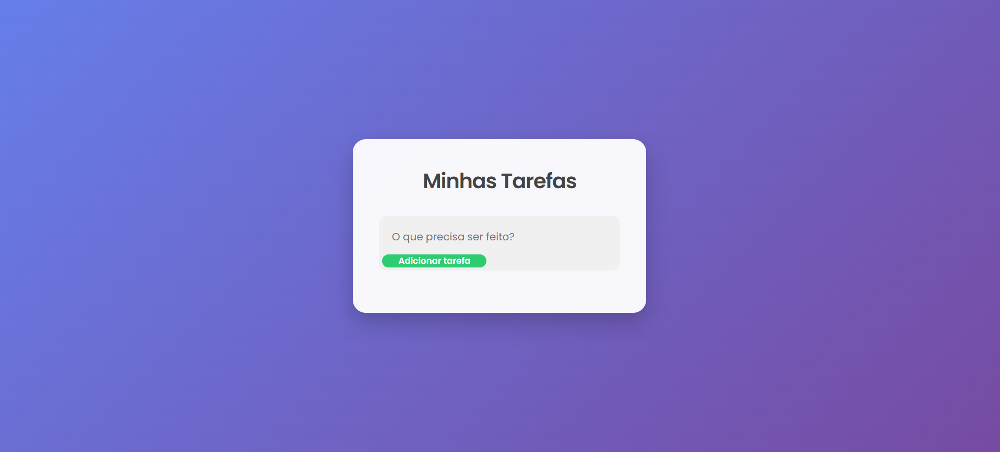

Lista de Tarefas

Aplicação de lista de tarefas com foco em organização de código e interações do usuário.

🔍 Visão geral

Projeto desenvolvido para treinar manipulação do DOM e boas práticas em JavaScript.

🛠️ Tecnologias

HTML

CSS

JavaScript

🚀 Deploy

🔗 https://rodolfosantiago03.github.io/PROJETO-LIST-TO-DO-LIST/

📸 Preview

⚙️ Funcionalidades

Adicionar tarefas

Marcar tarefas como concluídas

Remover tarefas

📌 Status

✅ Projeto finalizado
